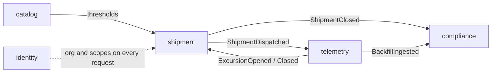

# ColdChain

Cold chain custody and compliance API. A pharmaceutical shipment passes from hand to hand between
organizations, its temperature is measured for the entire journey, and when it closes it **either has
a certificate or it doesn't**.

> **Status:** under construction. The full specification is closed and lives in
> [`docs/specification.md`](docs/specification.md); the decisions are in [`docs/adr/`](docs/adr/), and
> the order of work in [`docs/branching-plan.md`](docs/branching-plan.md). The code starts with the
> foundations and the `identity` module.

## The problem

A batch of vaccines leaves a lab, a carrier picks it up, it stops at an intermediate warehouse, a
second carrier picks it up and it arrives at a hospital. Four different organizations have held the
box, and **none of them takes another's word for it**. At the end of the journey somebody has to
answer two questions, with evidence:

1. Did the batch stay within its temperature range?
2. Who was holding it at any given moment?

This project answers those two questions and nothing else.

## Why this domain

The domain was chosen because it forces three problems a CRUD app never has to face:

- **Several organizations see the same shipment without owning it.** Visibility across organizations
  has to be solved without inventing an organization tree — see
  [ADR-003](docs/adr/ADR-003-visibility-by-participation.md).
- **The verdict is real arithmetic** over a time series: cumulative minutes out of band, data
  coverage. It is not a boolean somebody ticks by hand.
- **Readings arrive in volume, out of order and repeated.** Idempotent ingestion, indexes and
  partitioning stop being decoration.

## The five modules

They are numbered by dependency: that is also the build order.

| # | Module | Responsibility |
|---|---|---|
| 01 | `identity` | Organizations, users, roles and scopes. Who is asking, and with what permission. |
| 02 | `catalog` | Storage profiles, products and sites. What is shipped and under what conditions. |
| 03 | `shipment` | The shipment, its chain of custody and who can see it. |
| 04 | `telemetry` | Devices, temperature readings and excursion detection. |
| 05 | `compliance` | The certificate, its verdict and the findings that back it. |



Modules talk to each other through domain events, synchronous and in-process. **No `join` crosses a
module boundary:** references go by UUID and reads go through the owner's `api/`. Each module declares
its allowed dependencies in code — `@ApplicationModule(allowedDependencies = {...})` — and an import
that is not on the list **fails the build**.

Inside a module the shape is hexagonal: a pure-Java domain model, a repository port it declares, and an
adapter implementing it over JPA. The business rules — the state machine, the verdict arithmetic, the
excursion detection — are plain objects, so they are unit-tested in milliseconds with no database
anywhere near them. That is the point of it, and the reasoning is in
[ADR-007](docs/adr/ADR-007-hexagonal-module-internals.md).

## Stack

- **Java 25** (LTS) and **Spring Boot 4**
- **Oracle Database 23ai Free**, schema governed by **Flyway** alone — no `ddl-auto`
- **Spring Modulith** + **ArchUnit** for the boundaries, backed by a rule catalogue that runs as a CI
  gate — see [`rules/`](rules/)
- **Testcontainers** with `gvenzl/oracle-free` — a real Oracle in the integration tests, not H2
  pretending to be Oracle
- Spring Security with our own JWT, OpenAPI, Docker Compose

The reasoning is in [ADR-001](docs/adr/ADR-001-oracle-23ai.md) and
[ADR-006](docs/adr/ADR-006-modules-and-events.md).

## What this project enforces

Everything from the folder down to the field is declared in
**[`rules/project-rules.md`](rules/project-rules.md)** — around a hundred rules across sixteen groups,
each with a severity, the test that checks it, and whether that test exists yet. It is not a style
guide: `./gradlew rules` runs it on every push and every pull request, and it has no switch to turn it
off.

The catalogue verifies itself, too: a rule that cites a test that does not exist fails the build, and
so does a tolerated violation with no owner and no expiry date on it.

```bash
./gradlew rules      # the gate. Everything that does not need Oracle
./gradlew rulesDb    # the rules that can only be checked against a real database
```

## How to run it

```bash
docker compose up -d oracle      # Oracle 23ai Free, port 1521
./gradlew flywayMigrate          # schema from scratch
./gradlew bootRun                # API on 8080
```

```bash
./gradlew test                   # unit tests
./gradlew integrationTest        # with Testcontainers, requires Docker
```

## The demo

The walkthrough that exercises the whole system, meant to be watched in two minutes:

1. A lab creates a shipment of 400 vials with the `2 – 8 °C` profile and dispatches it.
2. A carrier accepts the handoff with a single-use code; custody changes hands.
3. A gateway pushes the temperature series in batches, with a 38-minute spike above 8 °C and a
   22-minute gap with no data. The same batch is sent again: **nothing is duplicated**.
4. The hospital accepts the delivery and the system issues the certificate: **FAIL**, with the
   excursion and the `DATA_GAP` as findings, plus the document hash to verify it later.

## Documentation

- [`docs/specification.md`](docs/specification.md) — tables, features and rules for the five modules.
  It is the contract: if the code and this document contradict each other, one of them is wrong.
- [`docs/adr/`](docs/adr/) — the architecture decisions, with their context and what was ruled out.
- [`docs/branching-plan.md`](docs/branching-plan.md) — the build order, branch by branch.
- **Implementation plans**, one per module:
  [01 identity](docs/plan-01-identity.md) ·
  [02 catalog](docs/plan-02-catalog.md) ·
  [03 shipment](docs/plan-03-shipment.md) ·
  [04 telemetry](docs/plan-04-telemetry.md) ·
  [05 compliance](docs/plan-05-compliance.md).
- **Data model** (draw.io):
  [`docs/coldchain-data-model.drawio`](docs/coldchain-data-model.drawio) — the 23 tables with their
  columns and relationships, and one page per module.

## License

MIT.
