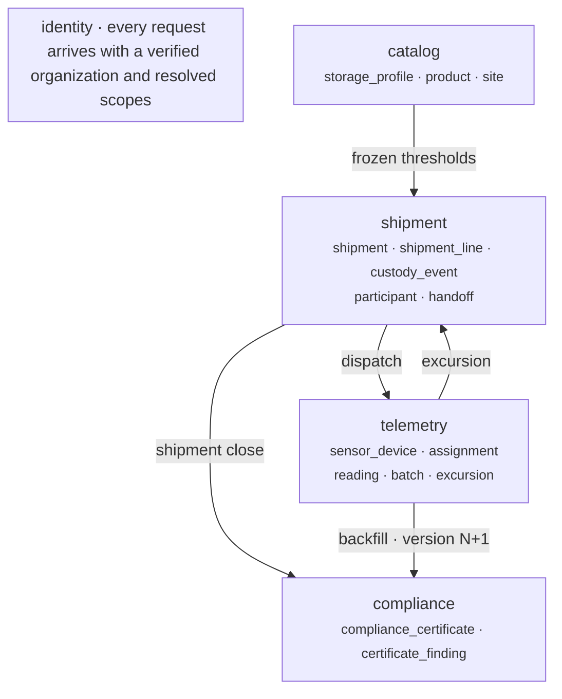
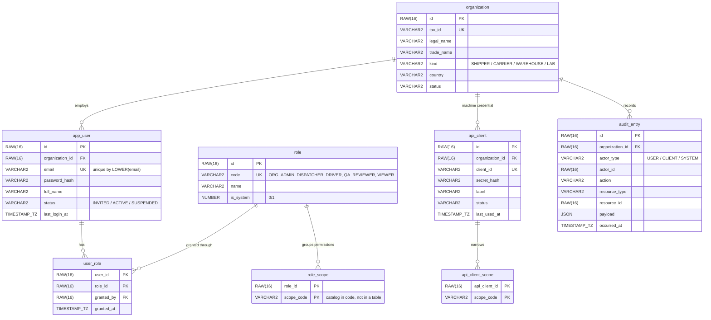
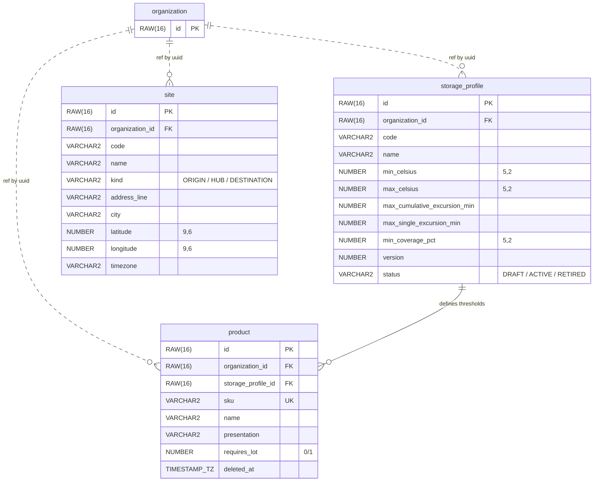
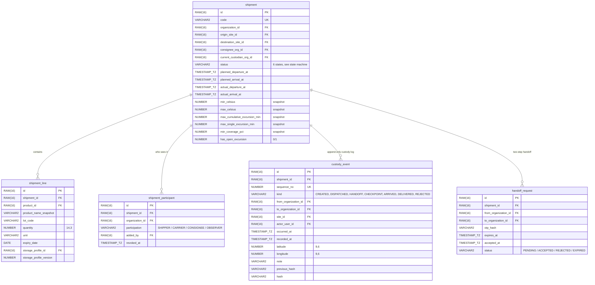
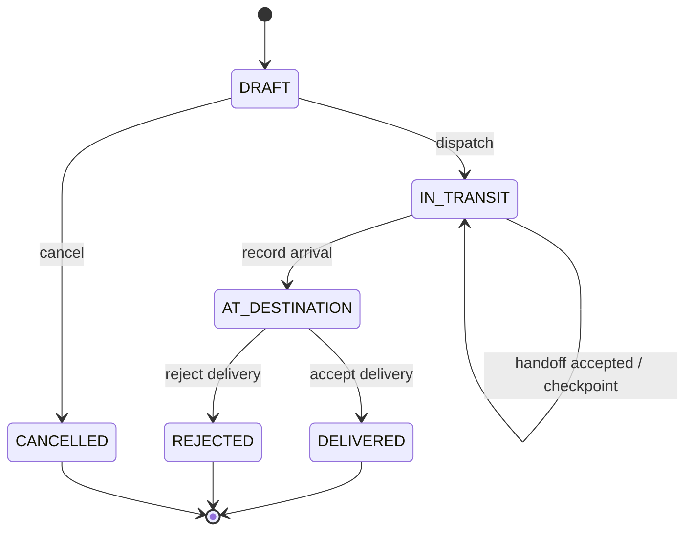
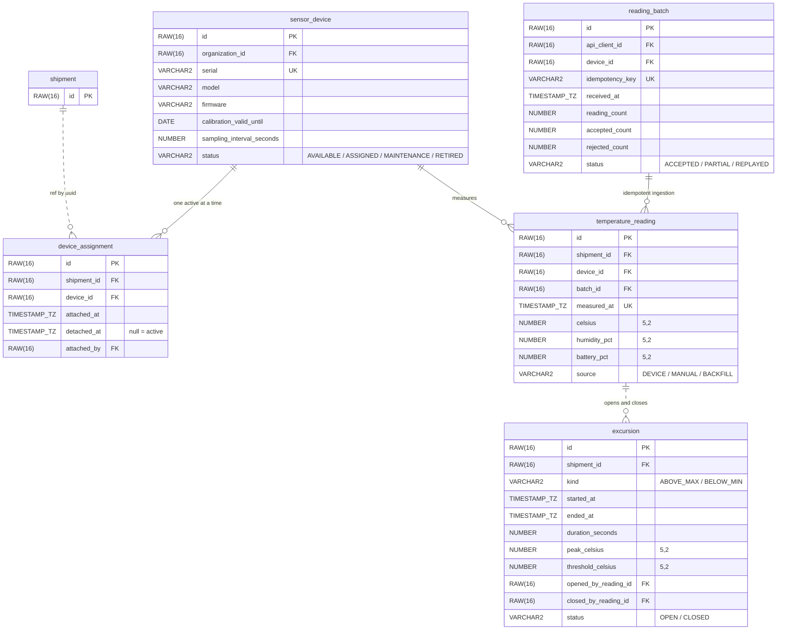
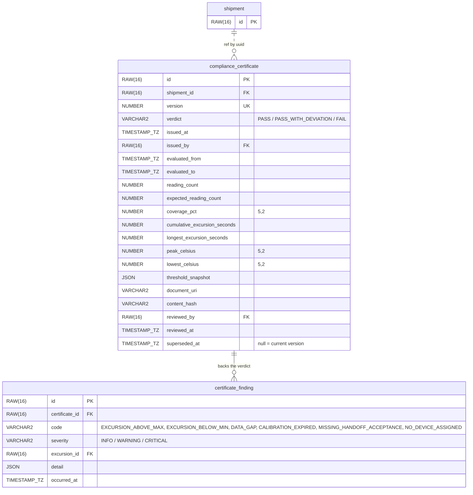

# ColdChain Specification

Tables, features and rules for the five modules. This is the contract: if the code and this document
contradict each other, one of the two is wrong and it gets fixed in the same change.

In the diagrams, `RAW(16)` is the UUID v7 in binary, `TIMESTAMP_TZ` is `TIMESTAMP WITH TIME ZONE` and
`NUMBER "0/1"` is a boolean with a `CHECK`. Every table carries `created_at` and `updated_at`;
`deleted_at` only appears where there is a soft delete.

- [How the five fit together](#how-the-five-fit-together)
- [01 · identity](#01--identity)
- [02 · catalog](#02--catalog)
- [03 · shipment](#03--shipment)
- [04 · telemetry](#04--telemetry)
- [05 · compliance](#05--compliance)
- [Oracle traps the design already respects](#oracle-traps-the-design-already-respects)

---

## How the five fit together

The shipment is the center: nothing moves without it. The two arrows that point back — the excursion
and the late reading — are what make the certificate impossible to compute in a single pass.

Communication happens through domain events, synchronous and in-process
([ADR-006](adr/ADR-006-modules-and-events.md)):

| Event | Direction | What it triggers |
|---|---|---|
| `ShipmentDispatched` | shipment → telemetry | Opens the monitoring window with the thresholds already frozen and the device assigned. |
| `ExcursionOpened` | telemetry → shipment | The shipment flags an open excursion; the carrier sees it in their listing without querying telemetry. |
| `ExcursionClosed` | telemetry → shipment | Closes the excursion with its final duration. |
| `ShipmentClosed` | shipment → compliance | Delivery or rejection: triggers issuing version 1 of the certificate. |
| `BackfillIngested` | telemetry → compliance | Readings arrived for an already closed shipment: the next version is issued. |

---

## 01 · identity

**Who is asking, and with what permission.**

### Features

- Organization sign-up with its first administrator (bootstrap), and email invitations for everyone
  else.
- Password login, issuing an *access token* and a *refresh token*, with rotation and revocation.
- Machine credentials (`client_credentials`) for the sensor gateways, with scopes narrowed down to
  ingestion.
- Granting and revoking roles; querying the effective scopes of the authenticated user.
- Automatic audit of every write: who, which resource, when and with what payload.

### Rules

- The scope catalog lives in code as an enum; the database stores only the assignment. A new
  permission is a reviewable code change, not a row somebody inserts in production.
- Every token carries the organization. The tenancy filter is applied once at the edge, not repeated
  by hand in every query.
- A user belongs to exactly one organization. Data from other organizations is seen through
  participation in a shipment ([ADR-003](adr/ADR-003-visibility-by-participation.md)), never through
  membership.
- Email is globally unique and case-insensitive: a unique index over `LOWER(email)`, because in
  Oracle the default comparison very much is case-sensitive.
- A machine credential's scopes are a child table, not a comma-separated string.

**Out of scope:** federated SSO, two-factor authentication, users in several organizations.

---

## 02 · catalog

**What gets shipped, and under what conditions.**

### Features

- Storage profiles: the range in degrees, the minutes tolerated out of band (cumulative and in a
  single stretch) and the minimum data coverage required.
- Products with their profile, presentation and whether they require a lot.
- Origin, transit and destination sites, with coordinates and a time zone of their own.
- Paginated listings with search; soft delete instead of a real delete.
- Cloning a profile into the next version when its thresholds have to change.

### Rules

- An `ACTIVE` profile already used by a shipment is not edited: it is cloned into version N+1 and the
  previous one moves to `RETIRED` ([ADR-004](adr/ADR-004-frozen-thresholds.md)).
- `min_celsius < max_celsius`, and the single-stretch tolerance never exceeds the cumulative one.
  Both are `CHECK` constraints on the table, not service-layer validation.
- Code and SKU are unique within the organization and only among the live rows: a function-based
  unique index that leaves the retired ones out.
- The time zone belongs to the site, not to the server: reports are read in the destination's local
  time.

**Out of scope:** bulk import, catalogs shared between organizations.

---

## 03 · shipment

**The shipment, its custody and who gets to see it.**

### State machine

### Features

- Create the shipment as a draft with its lines, origin, destination and consignee; add and revoke
  participants.
- Dispatch: checks there are lines, an assigned device and a consignee, freezes the thresholds and
  emits the first custody event.
- Two-step handoff: whoever hands over opens the request with a single-use code, whoever receives it
  accepts or rejects it. Custody changes only on acceptance.
- Record checkpoints with position, mark arrival, and close with the delivery accepted or rejected.
- A complete, verifiable timeline of the shipment: every event chains the hash of the previous one.
- A paginated listing that returns exactly the shipments the organization takes part in.

### Rules

- Visibility is participation. If your organization is not listed as a participant, the shipment does
  not exist for you ([ADR-003](adr/ADR-003-visibility-by-participation.md)).
- `custody_event` is append-only and hash-chained. A mistake is not fixed by editing the past: a
  compensating event is emitted.
- Thresholds are copied onto the shipment at dispatch. After that, touching the catalog changes
  nothing about what has already left ([ADR-004](adr/ADR-004-frozen-thresholds.md)).
- No transition happens outside the state machine, and the machine lives in the domain — not
  scattered across the controllers.
- `occurred_at` (when it happened) and `recorded_at` (when it was reported) are different fields. A
  driver with no signal syncs two hours late, and that has to stay visible.
- One pending handoff per shipment, guaranteed with a function-based unique index over the `PENDING`
  status. The code expires and is single-use.
- `sequence_no` is unique per shipment and gap-free. The number is reserved inside the event's own
  transaction, not with a global Oracle sequence.

**Out of scope:** route planning, rates and invoicing, qualified electronic signature.

---

## 04 · telemetry

**What the sensor measured, and when it went out of band.**

### Features

- Device inventory with its calibration and its declared sampling interval.
- Attach and detach a device from a shipment, leaving the time window on record.
- Batch ingestion with an idempotency key: it accepts out-of-order readings, resends and late
  recoveries, and answers how many it accepted, how many it discarded and why.
- Excursion detection when each batch is closed, with the opening and the closing traced to the exact
  reading that caused them.
- A queryable time series with per-minute or per-hour aggregation, so the chart of a long shipment
  does not return a hundred thousand rows.

### Rules

- A reading belongs to the shipment that had that device assigned at its `measured_at`, **not to the
  current shipment**. It is resolved by assignment window, and a reading outside every window is
  discarded with a reason.
- Resending the same batch duplicates nothing: the idempotency key replies with the original result,
  and the pair `device_id + measured_at` is unique.
- A device cannot have two active assignments. Oracle has no partial indexes, so the exclusion is
  done with a function-based unique index — `CASE WHEN detached_at IS NULL THEN device_id END` —
  taking advantage of `NULL`s not being indexed. It is not a check in Java.
- An excursion opens with the first reading out of band and closes with the first one back inside.
  While it is open, its duration is provisional.
- Ingestion is authorized by a machine credential with the ingestion scope and nothing else. A
  compromised gateway cannot read shipments.
- `temperature_reading` is range-partitioned with a monthly interval on `measured_at`: it is the only
  table that grows without a ceiling.
- The batch goes in as a single batch operation, with the UUIDs generated in the application so there
  is no round trip per row.

**Out of scope:** real device protocols (MQTT, LoRa), geofences, push alerts.

---

## 05 · compliance

**The verdict, and why.**

### How the verdict is decided

Two independent things sink a shipment: **the cumulative time out of band** and **the time with
nothing measured**. A gap in the series produces no excursion at all — nobody measured anything — and
that is exactly why the coverage rule is needed.

| Verdict | When |
|---|---|
| `PASS` | Coverage above the minimum and no excursions. |
| `PASS_WITH_DEVIATION` | Coverage good enough and excursions within tolerance, or calibration expired mid-trip. |
| `FAIL` | Excursion beyond tolerance (cumulative or in a single stretch), or coverage below the minimum. |

### Features

- Automatic certificate issuing when the shipment closes, with the numeric summary and the list of
  findings that back it.
- Versioned re-issue when late readings arrive: the previous version is not deleted, it is superseded
  and still readable.
- Manual review by a quality role, recorded without being able to change the computed verdict.
- Download of the certificate as PDF and of the full series as CSV, both with the content hash.
- A dashboard with compliance rate, excursions per carrier, average coverage and average time in
  transit.

### Rules

- The certificate is immutable. New data produces version N+1; there is never an `UPDATE` on one
  already issued ([ADR-005](adr/ADR-005-immutable-certificate.md)).
- The verdict is computed from the shipment's `threshold_snapshot`, never by reading the current
  profile from the catalog.
- Without the minimum coverage there is no `PASS`, even with not a single excursion: **not measuring
  is not complying**. The result is `FAIL` with a `DATA_GAP` finding.
- A calibration that expired mid-trip degrades the verdict to `PASS_WITH_DEVIATION` at best: the
  measurement exists but it is not defensible.
- Every finding points at the fact that produced it. A verdict without traceable findings is not
  issued.
- Coverage is computed against the **expected** readings for the device's sampling interval, not
  against the ones received.
- Only one current version per shipment: a function-based unique index that leaves the superseded
  ones out, and the pair `shipment_id + version` unique as well.

**Out of scope:** PKI signing, per-customer certificate templates, legal archiving.

---

## Oracle traps the design already respects

| Trap | How it is handled |
|---|---|
| **No partial indexes** | Conditional uniqueness with a function-based index: `CASE WHEN cond THEN col END`. Oracle does not index `NULL`s, so the rows that fail the condition drop out of the index on their own. It is the piece behind "one active assignment per device", "one pending handoff per shipment" and "one current certificate version". |
| **Booleans** | `NUMBER(1)` with `CHECK (col IN (0,1))`, mapped to `boolean` by Hibernate. The native 23ai `BOOLEAN` still springs surprises on indexes and drivers. |
| **Empty string is `NULL`** | `''` and `NULL` are the same thing. Required fields are defended with `NOT NULL` plus `CHECK (TRIM(col) IS NOT NULL)`, not by comparing against an empty string. |
| **`JSON` and `CLOB` in queries** | They cannot appear in `DISTINCT`, `GROUP BY` or an equality predicate: ORA-22848 shows up at runtime, not at compile time. `payload`, `detail` and `threshold_snapshot` are only read by key. |
| **`TRUNC` loses precision** | `TRUNC(measured_at,'MI')` turns the `TIMESTAMP` into a `DATE` and takes the fractional seconds with it. The *downsampling* grouping does the `CAST` explicitly. |
| **The table that grows** | `temperature_reading` with range partitioning and a monthly interval on `measured_at`. Included in the Free edition. |
| **Oracle Free ceiling** | 12 GB of user data and 2 GB of RAM. The demo's series generator works inside that ceiling on purpose. |
| **Test startup** | Testcontainers with `gvenzl/oracle-free:23-slim-faststart` and the container reused across classes. A real Oracle, not H2 pretending to be Oracle — which is exactly where these traps would hide until production. |
